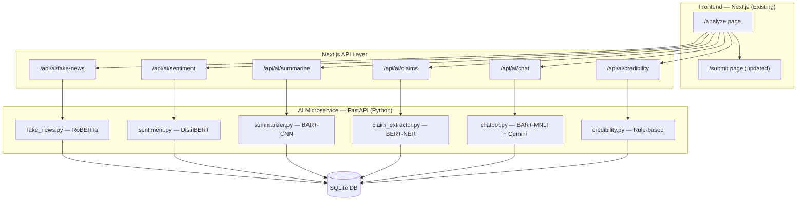

# TruthLens AI Features — Implementation Plan

Add a Python FastAPI AI microservice with HuggingFace models to the existing TruthLens Next.js app. **No rebuilding** — only new files and minimal modifications to existing ones.

## System Architecture



> [!IMPORTANT]
> The current database is **SQLite** (not PostgreSQL). The plan keeps SQLite for now. If you want to migrate to PostgreSQL/Supabase later, only the `DATABASE_URL` in [.env](file:///f:/SOftware%20Devolpoment/TruthLens/.env) needs to change.

---

## Proposed Changes

### Phase 1 — Python FastAPI AI Service

New directory `ai-service/` at project root with all AI models.

#### [NEW] ai-service/requirements.txt
Dependencies: FastAPI, uvicorn, transformers, torch, pydantic.

#### [NEW] ai-service/main.py
FastAPI app with 6 endpoints, CORS config, health check.

#### [NEW] ai-service/models/fake_news.py
- Model: `roberta-base` fine-tuned for fake news (zero-shot via `facebook/bart-large-mnli`)
- Input: article text → Output: `{label, confidence, explanation}`

#### [NEW] ai-service/models/sentiment.py
- Model: `distilbert-base-uncased-finetuned-sst-2-english`
- Input: text → Output: `{sentiment, confidence, scores}`

#### [NEW] ai-service/models/summarizer.py
- Model: `facebook/bart-large-cnn`
- Input: article text → Output: `{summary, bullet_points}`

#### [NEW] ai-service/models/claim_extractor.py
- Model: `dslim/bert-base-NER`
- Input: text → Output: `{claims[], entities[]}`

#### [NEW] ai-service/models/chatbot.py
- Uses Gemini API (already configured) for conversational responses
- Falls back to zero-shot classification for offline mode

#### [NEW] ai-service/models/credibility.py
- Rule-based domain scoring from existing Source database
- Input: domain → Output: `{score, tier, factors[]}`

---

### Phase 2 — Next.js API Proxy Routes

New API routes that proxy requests to the FastAPI service.

#### [NEW] src/app/api/ai/fake-news/route.ts
#### [NEW] src/app/api/ai/sentiment/route.ts
#### [NEW] src/app/api/ai/summarize/route.ts
#### [NEW] src/app/api/ai/claims/route.ts
#### [NEW] src/app/api/ai/chat/route.ts
#### [NEW] src/app/api/ai/credibility/route.ts

Each route: validates auth → forwards to FastAPI → stores result in DB → returns response.

---

### Phase 3 — Database Schema Updates

#### [MODIFY] [schema.prisma](file:///f:/SOftware%20Devolpoment/TruthLens/prisma/schema.prisma)

Add new models for AI results:

```prisma
model AIAnalysis {
  id             String   @id @default(cuid())
  submissionId   String
  submission     Submission @relation(fields: [submissionId], references: [id])
  type           String   // FAKE_NEWS, SENTIMENT, SUMMARY, CLAIMS
  result         String   // JSON string of AI result
  confidence     Float
  modelUsed      String
  processingTime Int      // ms
  createdAt      DateTime @default(now())
}

model ChatMessage {
  id        String   @id @default(cuid())
  userId    String
  user      User     @relation(fields: [userId], references: [id])
  role      String   // USER, ASSISTANT
  content   String
  context   String?  // JSON: related submission/analysis IDs
  createdAt DateTime @default(now())
}
```

Add relations to existing [Submission](file:///f:/SOftware%20Devolpoment/TruthLens/src/app/report/page.tsx#10-24) and [User](file:///f:/SOftware%20Devolpoment/TruthLens/src/app/sources/page.tsx#17-23) models.

---

### Phase 4 — Frontend /analyze Page

#### [NEW] src/app/analyze/page.tsx

A comprehensive analysis dashboard with tabs:
- **Fake News Detection** — paste text, get TRUE/FALSE/MISLEADING verdict
- **Sentiment Analysis** — emotional tone breakdown
- **Summarize** — generate summary + bullet points
- **Claim Extractor** — extract factual claims + entities
- **AI Chat** — ask questions about any analysis
- **Source Check** — domain credibility scorer

#### [NEW] src/components/AIAnalysisCard.tsx
Reusable card component for displaying AI results.

#### [NEW] src/components/AIChatWidget.tsx
Floating chat widget accessible from any page.

---

### Phase 5 — Update Existing Submit Page

#### [MODIFY] [submit/page.tsx](file:///f:/SOftware%20Devolpoment/TruthLens/src/app/submit/page.tsx)
After claim submission, show option to run full AI analysis (links to /analyze).

#### [MODIFY] [dashboard/page.tsx](file:///f:/SOftware%20Devolpoment/TruthLens/src/app/dashboard/page.tsx)
Add AI analysis summary cards to submission history.

---

### Phase 6 — Environment & Config

#### [MODIFY] [.env](file:///f:/SOftware%20Devolpoment/TruthLens/.env)
```
AI_SERVICE_URL="http://localhost:8000"
```

---

## Data Flow

```
User pastes article text on /analyze
  → Frontend calls /api/ai/fake-news (POST)
    → Next.js API validates auth
    → Proxies to FastAPI http://localhost:8000/fake-news
      → FastAPI loads RoBERTa model
      → Runs inference
      → Returns {label, confidence, explanation}
    → Next.js API stores result in AIAnalysis table
    → Returns result to frontend
  → Frontend displays verdict with confidence gauge
```

## Verification Plan

### Automated Tests
- `curl` test all 6 FastAPI endpoints
- `npm run build` to verify Next.js compilation

### Manual Verification
1. Start FastAPI with `uvicorn main:app --reload`
2. Start Next.js with `npm run dev`
3. Test each AI feature on `/analyze` page
4. Verify results are stored in database

## AI Models Summary

| Feature | Model | Size | Speed |
|---------|-------|------|-------|
| Fake News | `facebook/bart-large-mnli` | ~1.6GB | ~2s |
| Sentiment | `distilbert-base-uncased-finetuned-sst-2-english` | ~250MB | ~0.5s |
| Summarize | `facebook/bart-large-cnn` | ~1.6GB | ~3s |
| NER/Claims | `dslim/bert-base-NER` | ~400MB | ~1s |
| Chatbot | Gemini API (existing key) | Cloud | ~1s |
| Credibility | Rule-based | 0MB | <0.1s |

> [!WARNING]
> First run will download ~4GB of models. After that, they're cached locally. The AI service needs **at least 8GB RAM** to load all models simultaneously.

> [!TIP]
> Models are loaded lazily (on first request), so startup is fast. Each model loads only when its endpoint is first called.
