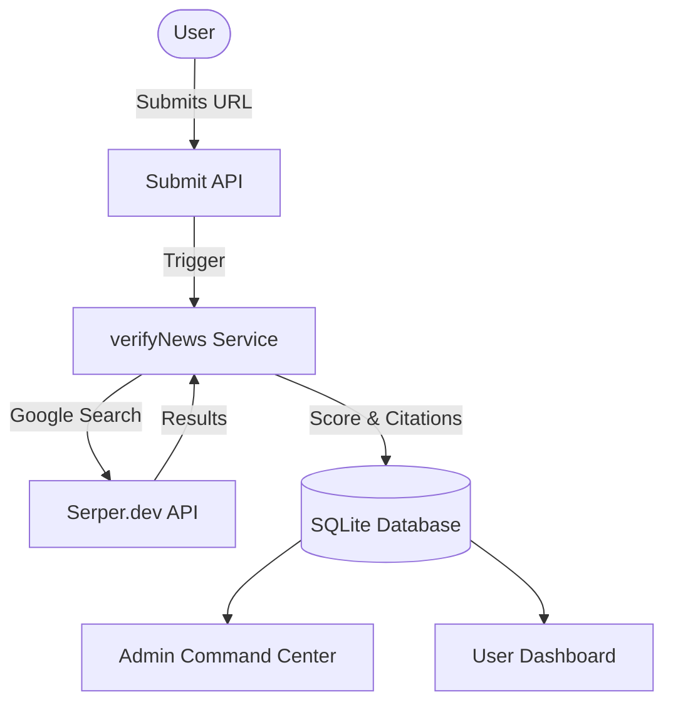

# 🛡️ TruthLens: Neural Information Stream

**TruthLens** is a high-fidelity information verification platform designed to combat misinformation and analyze news credibility in real-time. Using advanced cross-referencing algorithms and an integrated search engine, TruthLens provides a "Neural" approach to digital truth assessment.


---

## 🚀 Core Intelligence Features

### 🧠 Truth Verification Engine
The heart of TruthLens. When a news URL is submitted, the engine triggers a real-time global search to find corroborating reports.
- **Neural Cross-Referencing**: Analyzes facts across multiple trusted intelligence nodes.
- **Citations & Evidence**: Provides a verified list of matching reports to the user.
- **Fake News Detection**: Explicitly flags content as **FAKE** if no corroborated reports are found across the global grid.

### 📊 Accuracy Scoring
Every submission is assigned a weighted **Trust Score (0-100%)** based on:
- **Source Density**: Frequency of reporting across diverse networks.
- **Source Reputation**: Weighted analysis of the reporting domain's historical bias.
- **Fact Consistency**: Cross-site alignment of core reporting data.

### 🛡️ Administrative Suite
A unified command center for platform oversight.
- **Review Hub**: Global monitoring of all user submissions and analysis results.
- **Source Database**: Real-time auditing of misinformation tiers (Trusted, Questionable, Disinfo).
- **Feedback Stream**: Intercept and review user support transmissions and sentiment.

---

## 🛠️ Technical Architecture

TruthLens is built for speed and stability on the cutting edge of the web.

- **Frontend**: [Next.js 16](https://nextjs.org/) (Turbopack) for blazing-fast interactivity.
- **Styling**: [Tailwind CSS 4](https://tailwindcss.com/) with a custom "Neural Glow" glassmorphism design system.
- **Database**: [SQLite](https://sqlite.org/) managed via [Prisma 6](https://www.prisma.io/).
- **Authentication**: Secure JWT-based session management with role-based access control.
- **Search Engine**: Integrated [Serper.dev](https://serper.dev/) for real-time web cross-referencing.



---

## ⚙️ Setup & Deployment

### 1. Prerequisites
- Node.js 22.x
- npm / pnpm

### 2. Environment Configuration
Create a `.env` file in the root directory:

```env
DATABASE_URL="file:./dev.db"
AUTH_SECRET="your_secure_secret_here"
SERPER_API_KEY="your_serper_api_key_here"
```

### 3. Installation
```bash
# Install dependencies
npm install

# Initialize the intelligence database
npx prisma migrate dev --name init

# Start the Neural Stream
npm run dev
```

---

## 🎨 Design System
TruthLens utilizes a premium **Dark-Mode Neural Aesthetic**:
- **Glassmorphism**: Backdrop blur components with subtle border glows.
- **Animated Gradients**: Dynamic blue-to-indigo flows representing information processing.
- **Micro-animations**: Interactive hover states and scanning indicators.

---

## 🤝 Contributing
TruthLens is built by information researchers for a more transparent digital future. Contributions to the bias database and verification algorithms are welcome.

**Platform Status**: ✅ Stable Release - v1.0.0
